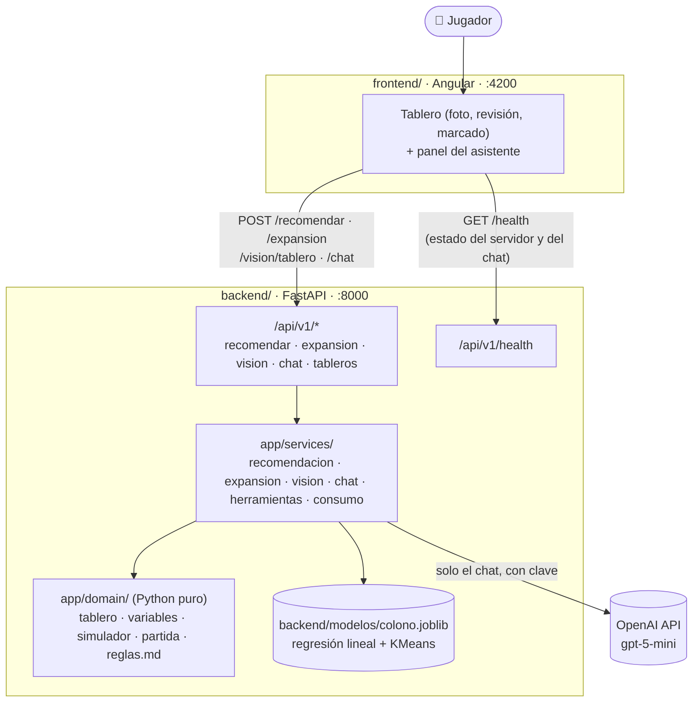
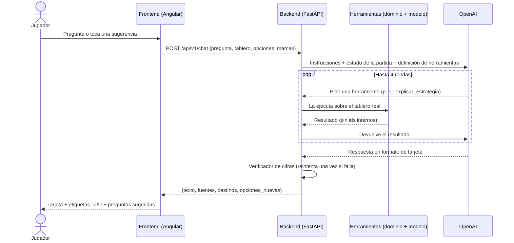
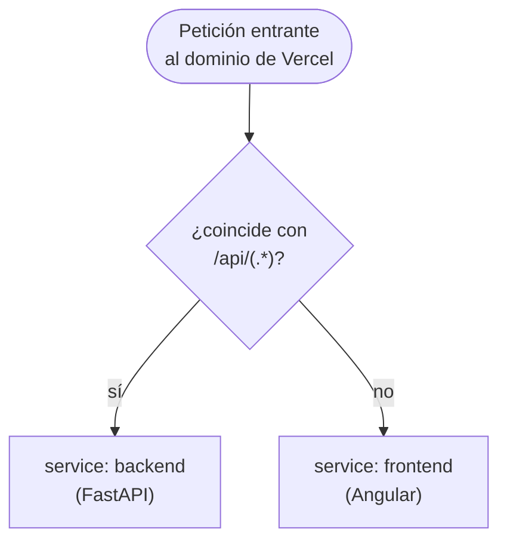

# Colono IA

Proyecto final del Módulo 5 del diplomado (Ana Bohórquez, 2026): una guía para colocar y
jugar Catan. Fotografías el tablero recién armado y la app te dice dónde poner tus dos
primeros poblados y por qué; después sigue contigo durante la partida y un asistente
experto te aconseja qué construir y hacia dónde crecer. El repositorio es un monorepo con
el backend y el frontend al mismo nivel:

```
backend/       # API en FastAPI (Python): dominio del juego, modelo, visión y chat
               #   backend/modelos/colono.joblib: el modelo entrenado por 02_modelo.ipynb
frontend/      # Aplicación en Angular (TypeScript): tablero y asistente
notebooks/     # Datos, EDA y modelado (00 → 01 → 02), reproducibles en Colab
data/processed # parejas.csv, generado por backend/scripts/generar_dataset.py
docs/          # conceptos-catan.md: el dominio del juego explicado
vercel.json    # despliegue en Vercel Services (ver «Despliegue»)
```

**El problema.** La colocación inicial decide buena parte de la partida y se toma por
intuición en menos de un minuto. Sobre 200 tableros simulados, la pareja que recomienda el
modelo vale **un punto de victoria más** que la que elegiría un jugador guiándose por los
pips, que es el criterio habitual en la mesa. Y ya colocados los poblados, el jugador
casual sigue sin saber qué construir primero ni hacia dónde expandirse.

## Arquitectura



En producción (Vercel) ambos servicios quedan bajo el mismo dominio — ver
["Despliegue"](#despliegue) para el diagrama de ruteo.

## Backend (FastAPI)

El entorno se maneja con [uv](https://docs.astral.sh/uv/). En Windows, desde PowerShell:

```powershell
cd backend
uv sync --extra dev                      # crea .venv e instala todo (una vez)
uv run uvicorn app.main:app --reload --reload-dir app --port 8000
```

`--reload-dir app` hace que el servidor solo se reinicie al cambiar el código, no cada vez
que algo se escribe dentro de `.venv/`.

- Documentación interactiva: http://localhost:8000/docs
- Salud del servicio: http://localhost:8000/api/v1/health. Dice si el modelo está cargado,
  si el chat usa el LLM y, si no, por qué (`sin_clave`, `clave_invalida` o
  `sin_presupuesto`). Nunca expone la clave. El frontend lo usa para el indicador de la
  cabecera y para avisar del «modo básico».
- Tests: `uv run pytest -q`. No usan red ni la clave real (`tests/conftest.py` la vacía).
- Estilo: `uv run ruff check app`.

| Método | Ruta | Qué hace |
|---|---|---|
| GET | `/api/v1/health` | Estado del servicio y del chat |
| GET | `/api/v1/modelo` | Variables y métricas del modelo |
| GET | `/api/v1/tableros/aleatorio` | Un tablero válido (el de demostración) |
| POST | `/api/v1/tableros/validar` | Reconstruye un tablero y avisa si no cuadra con el juego base |
| POST | `/api/v1/vision/tablero` | Lee terrenos y números de una foto |
| POST | `/api/v1/recomendar` | **La colocación inicial**: mejores parejas de poblados, o el mejor segundo poblado |
| POST | `/api/v1/expansion` | Hacia dónde crecer: destinos A, B y C para el siguiente poblado |
| POST | `/api/v1/chat` | El asistente: colocación, partida y reglas |

La lógica vive en `app/services/` y el dominio del juego en `app/domain/`, que es Python
puro (se usa igual desde los notebooks). Los endpoints de `app/api/v1/` solo traducen HTTP.

### Asistente con OpenAI

`POST /api/v1/chat` llama a `services/chat.py`. El modelo de lenguaje **no recibe datos en
el prompt**: los pide a herramientas del backend, y un verificador rechaza la respuesta si
trae cifras que no salieron de ellas. Así el LLM redacta, pero no puede contradecir al
modelo ni inventar reglas.



**1. Configurar la clave** (solo en el backend; nunca se envía al frontend):

Crea `backend/.env` con, al menos, esta línea:

```
OPENAI_API_KEY=sk-...
```

Otras variables opcionales: `OPENAI_MODEL` (por defecto `gpt-5-mini`), `OPENAI_ESFUERZO`
(`minimal`), `CHAT_PRESUPUESTO_DIARIO_USD` (`1.0`), `CHAT_PREGUNTAS_POR_IP` (`15`) y
`ENTORNO` (`desarrollo`). Todas tienen su valor por defecto en `app/core/config.py`.
`backend/.env` no se versiona. **Sin clave, el chat funciona en modo básico**: responde con
plantillas que usan las mismas herramientas, y la interfaz lo avisa con «⚙️ Modo básico».
Reinicia `uvicorn` después de editar el `.env`.

**2. Dónde está cada pieza:**

| Qué | Archivo | Qué contiene |
|---|---|---|
| Orquestación | `backend/app/services/chat.py` | `INSTRUCCIONES`, el bucle con la Responses API, el verificador `cifras_sin_respaldo()` y las plantillas del modo básico |
| Herramientas | `backend/app/services/herramientas.py` | 14 herramientas: opciones en pantalla, comparar, pedir otra recomendación, estado del tablero, costos, mano, cómo conseguir un recurso, plan de construcción, probabilidades, resumen del tablero, `explicar_estrategia`, `mi_produccion`, `hacia_donde_expandir` y `consultar_reglas` |
| Límites y registro | `backend/app/services/consumo.py` | Preguntas por IP, presupuesto diario en US$, detección de clave rechazada y una línea por pregunta en `logs/consumo.jsonl` |
| Reglas | `backend/app/domain/reglas.md` | Las reglas que puede citar el chat; **solo las marcadas `verificado: sí`** |
| Partida en curso | `backend/app/domain/partida.py` | Producción de todas tus piezas (las ciudades cuentan doble) y rondas hasta cada construcción |
| Hacia dónde crecer | `backend/app/domain/expansion.py` | Destinos para el siguiente poblado con una fórmula a la vista |

### Notas operativas del asistente

- **Costo y velocidad:** con `gpt-5-mini` y esfuerzo `minimal`, cada pregunta cuesta
  ≈ US$0.001 y tarda unos 7 s. `scripts/evaluar_chat.py` mide calidad, latencia y costo
  con preguntas fijas (usa la API real: cuesta centavos).
- **Clave rechazada:** si OpenAI responde `AuthenticationError`, el backend deja de
  intentarlo durante 10 minutos, `/health` dice `clave_invalida` y el chat sigue en modo
  básico. Pasado ese tiempo vuelve a probar, por si ya pusiste una clave nueva.
- **Reglas sin verificar:** las 17 entradas de `reglas.md` están escritas, pero solo se citan
  las que alguien contrastó con el reglamento. `scripts/aplicar_verificacion.py` pasa a
  `reglas.md` los resultados de la página de verificación.
- **Formato:** las respuestas usan un Markdown mínimo (`### título`, listas, `Haz:` /
  `Evita:`) que el frontend convierte en bloques. Nunca se inserta HTML.
- **Preguntas sugeridas:** después de cada respuesta, el frontend propone el siguiente paso
  según el tema y una pregunta 📘 para aprender un concepto del juego. Todas tienen respuesta
  también en modo básico.

### Modelo y datos

```powershell
cd backend
uv run python -m scripts.generar_dataset        # ~25 min, 200 tableros → data/processed/parejas.csv
uv sync --extra dev --extra notebooks
```

Después abre `notebooks/00_ingenieria_variables.ipynb`, `01_eda.ipynb` y `02_modelo.ipynb`
en Cursor, VS Code o Jupyter con el kernel **`backend/.venv`**. El modelo se debe entrenar
con la misma versión de scikit-learn que usa el backend (**1.8.0**, fija en
`pyproject.toml`); si no, el backend lo carga con advertencias de incompatibilidad.
`02_modelo` sobrescribe `backend/modelos/colono.joblib`.

- **Modelo:** regresión lineal sobre 12 variables de la pareja (R² 0.642 en tableros de
  prueba, separados por tablero), más un KMeans que agrupa las parejas en cuatro familias
  de estrategia. Se eligió la regresión, y no un ensamble, porque sus coeficientes son la
  explicación que ve el usuario.
- **Datos:** simulación propia de partidas (aprobada por el profesor); no existe una API
  pública de partidas de Catan.

### Visión (la foto del tablero)

`services/vision.py` y `services/vision_fichas.py`, con OpenCV. Encuentra las fichas
numéricas, ajusta la cuadrícula hexagonal con ellas y lee terrenos por color y números por
rasgos (rojo, dígitos, agujeros y pips). Los reparte respetando el juego base con el
algoritmo húngaro. Lee el tablero **vacío**: los poblados se marcan con un clic. Los puertos
salen de una plantilla del marco. Lo dudoso se revisa a mano en la interfaz con un toque.

## Frontend (Angular)

```powershell
cd frontend
npm install        # solo la primera vez
npm start          # equivale a ng serve
```

- Aplicación: http://localhost:4200
- La URL del backend se configura en `frontend/src/environments/environment.development.ts`
  (`apiUrl: 'http://localhost:8000/api/v1'`).
- Los tipos de la API **no se escriben a mano**: se generan del contrato del backend.
  Después de cambiar un esquema:
  `cd backend; uv run python -m scripts.exportar_openapi`, y luego
  `cd frontend; npm run api:tipos`.
- Tests: `npx ng test --watch=false`.
- Tailwind v4 con los colores del juego definidos en `src/styles.css`.

## Correr todo en desarrollo

Se necesitan **dos terminales**, una por servicio:

1. Terminal 1: `cd backend; uv run uvicorn app.main:app --reload --reload-dir app --port 8000`
2. Terminal 2: `cd frontend; npm start`

Con ambos corriendo, abre http://localhost:4200 y prueba el recorrido completo:

1. **Tablero de demostración** (o 📷 **Tomar foto** / 🖼️ **Subir foto**, y revisar).
2. **Recomendar**: el tablero resalta las tres opciones y el chat las presenta.
3. Pregunta al chat o toca una sugerencia: «¿Qué estrategia sigo?», «📘 ¿Qué son los pips?».
4. Marca **Rival** y **Mi poblado** en el tablero: las opciones se recalculan solas.
5. Con tus dos poblados puestos empieza la partida: marca ciudades (🏰), pregunta «¿Qué
   construyo ahora?» y «🧭 ¿Hacia dónde crezco?».
6. **↺ Nueva partida** para empezar otra colocación en el mismo tablero o de cero.

En la pestaña Network del navegador se ven las peticiones a
`http://localhost:8000/api/v1/...`.

## Despliegue

`vercel.json` (raíz del repo) usa la feature [Services](https://vercel.com/docs/services)
de Vercel para desplegar frontend y backend como un solo proyecto, en un solo dominio:

```json
{
  "$schema": "https://openapi.vercel.sh/vercel.json",
  "services": {
    "backend": { "root": "backend", "framework": "fastapi", "entrypoint": "app.main:app" },
    "frontend": {
      "root": "frontend", "framework": "angular",
      "buildCommand": "npm run build", "outputDirectory": "dist/colono-ia/browser"
    }
  },
  "rewrites": [
    { "source": "/api/(.*)", "destination": { "service": "backend" } },
    { "source": "/(.*)", "destination": { "service": "frontend" } }
  ]
}
```

Las `rewrites` se evalúan en orden — la primera regla que coincide decide el destino:



- **El backend recibe la ruta completa** (`/api/v1/recomendar`, no `/v1/recomendar`), y
  todas sus rutas ya viven bajo `/api/v1`, incluida `/api/v1/health`. Por eso basta una
  regla.
- `entrypoint: "app.main:app"` es el mismo módulo:variable que usa `uvicorn` en local.
- El frontend de producción (`frontend/src/environments/environment.ts`) usa la ruta
  relativa `/api/v1`: no necesita variables de entorno ni CORS.
- **Todo lo que el backend lee en producción debe estar dentro de `backend/`**: Vercel solo
  empaqueta la carpeta del servicio. Por eso el modelo vive en `backend/modelos/` y `openai`
  es una dependencia principal (Vercel no instala los extras).

**En el dashboard de Vercel** (pantalla de importar el proyecto):
- **Root Directory** en `./`: ahí está `vercel.json` con la clave `services`.
- **Build and Output Settings** apagados: en modo `services` se definen por servicio en
  `vercel.json`.
- **Environment Variables**:

| Variable | Valor | Secreta |
|---|---|---|
| `OPENAI_API_KEY` | la clave del proyecto de OpenAI | **sí** |
| `ENTORNO` | `produccion` (no intenta escribir `logs/`) | no |
| `OPENAI_ESFUERZO` | `minimal` | no |
| `CHAT_PRESUPUESTO_DIARIO_USD` | `1.0` (tope de gasto del chat por día) | no |

**Riesgos conocidos:** Services está en beta; el bundle de Python (OpenCV, SciPy,
scikit-learn, pandas) ronda los 400 MB de un límite de 500 MB; los límites del chat
(preguntas por IP y presupuesto diario) se guardan en memoria de cada instancia, así que el
tope es aproximado; y la primera petición tras un rato sin uso tarda unos segundos en cargar
el modelo.

## Estructura pensada para crecer

- `backend/app/api/v1/`: un endpoint nuevo es un módulo nuevo que se registra en
  `router.py`.
- `backend/app/services/`: lógica de negocio, independiente de HTTP. Un cálculo que usan
  un endpoint y el chat vive aquí una sola vez (por ejemplo, `recomendacion.calcular` y
  `expansion.calcular`).
- `backend/app/services/herramientas.py`: una herramienta nueva del asistente es una
  definición estricta en `DEFINICIONES` más un método `_nombre` en `Herramientas`; la
  prueba `test_todas_las_herramientas_tienen_implementacion` verifica que coincidan.
- `backend/app/domain/`: reglas y cálculos del juego, sin saber que existe la web.
- `frontend/src/app/`: el estado vive en `App` (tablero, marcas, selección) y los
  componentes (`tablero/`, `asistente/`, `revision/`) solo lo muestran y emiten eventos.
  Las marcas del tablero son la única verdad de la partida (`colocacion.ts`).
- `frontend/src/app/asistente/sugerencias.ts`: una pregunta sugerida nueva se agrega al
  catálogo **junto con** su intención en las plantillas del backend, para que el modo
  básico también la sepa contestar.
- `AGENTS.md` recoge las decisiones cerradas, las trampas encontradas y el estado de cada
  pieza; `docs/conceptos-catan.md` explica el dominio del juego.
