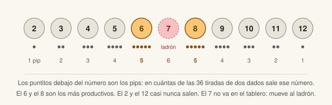
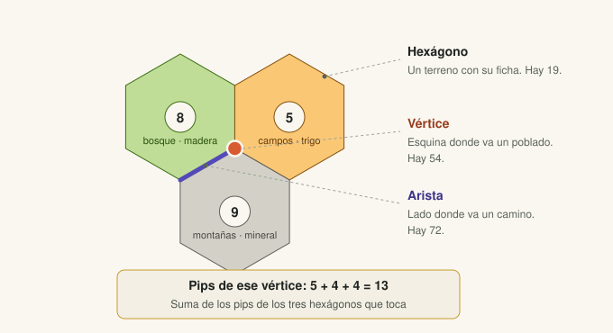
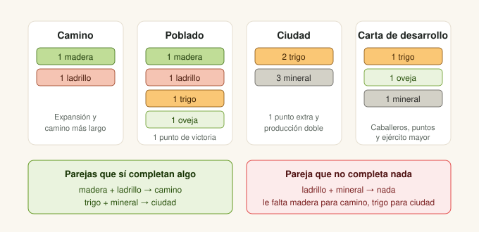

# Conceptos de Catan que usa el proyecto

> Documento vivo. Cada concepto del juego que aparece aquí se traduce después en una variable del modelo. Si un concepto no termina en una variable, sobra; si una variable no está explicada aquí, falta documentarla.

---

## 1. El pip

Cada ficha numérica del tablero tiene puntitos debajo del número. Esos puntitos son los **pips**, y dicen en cuántas de las 36 combinaciones posibles de dos dados sale ese número.

El 7 no lleva ficha porque no está en el tablero: cuando sale, se mueve el ladrón.

En el código, esto es el diccionario `PIPS` de `src/tablero.py`. La suma de pips de todas las fichas del juego base es **58**, y `verificar_tablero()` lo comprueba.

---

## 2. Hexágono, vértice y arista

| Término | Qué es | Cuántos hay | En el código |
|---|---|---|---|
| Hexágono | Un terreno con su ficha numérica | 19 | `coordenadas_hexagonos()` |
| Vértice | Esquina donde va un poblado o ciudad | 54 | `todos_los_vertices()` |
| Arista | Lado donde va un camino | 72 | `todas_las_aristas()` |

**La decisión de diseño clave:** un vértice no se guarda con coordenadas x/y, sino como el **conjunto de los tres hexágonos que toca**. De ahí salen gratis tres cosas:

- Los pips del vértice son la suma de los pips de esos hexágonos.
- Dos vértices son vecinos si comparten exactamente dos hexágonos, y de ahí sale la regla de distancia mínima.
- Un vértice de la orilla toca uno o dos hexágonos del tablero en vez de tres, sin necesidad de marcarlo aparte.

---

## 3. Terrenos y recursos

| Terreno | Recurso | Cuántos hexágonos |
|---|---|---|
| Bosque | Madera | 4 |
| Pastos | Oveja | 4 |
| Campos | Trigo | 4 |
| Colinas | Ladrillo (arcilla) | 3 |
| Montañas | Mineral (piedra) | 3 |
| Desierto | Ninguno | 1 |

El desierto no lleva ficha numérica y aporta 0 pips. Un vértice que lo toca produce como si tuviera un hexágono menos.

---

## 4. Por qué los pips solos no bastan

Este es el punto más importante del proyecto, y la razón de que el modelo no sea simplemente "ordena los vértices por pips".

Un vértice con 12 pips repartidos entre ladrillo y mineral suena excelente, pero **esa pareja no completa ninguna construcción**: al camino le falta madera, y a la ciudad le falta trigo. Vas a acumular cartas que no puedes gastar.

En cambio, un vértice con 10 pips bien repartidos entre madera y ladrillo te deja construir caminos desde el turno 2.

**Conclusión para el modelo:** lo que predice el desempeño no es el total de pips, sino **cómo se reparten entre recursos que se complementan**. Por eso existen las variables de Fase 2:

- `pips_madera_ladrillo` — la pareja que da caminos y poblados
- `pips_trigo_mineral` — la pareja que da ciudades
- `num_recursos_distintos` — cuántos de los cinco produces
- `recursos_faltantes` — cuáles no produces en absoluto

---

## 5. Las cuatro familias de estrategia

Según cómo se reparta tu producción, la partida se juega distinto. La app clasifica cada **pareja** de poblados en una de cuatro familias, y cada una trae su consejo.

| Familia | Ícono | Qué la distingue | Cómo ganas |
|---|---|---|---|
| **Expansión** | 🛤️ | Mucha madera y ladrillo a la vez (`par_camino` alto) | Más poblados y la carta de camino más largo |
| **Ciudades y desarrollo** | 🏰 | Trigo, oveja y mineral juntos (`trio_desarrollo` alto) | Subir poblados a ciudad (producción doble) y comprar cartas de desarrollo |
| **Puerto y conversión** | ⚓ | Mucho de un recurso y el puerto 2:1 de ese recurso (`puerto_alineado` alto) | Cambiar tu recurso dominante a mitad de precio |
| **Producción desequilibrada** | ⚖️ | Lo que queda: muchas cartas, pero de pocos tipos | No es un plan: hay que comerciar mucho para gastar lo que recibes |

Esto es lo que convierte la salida del modelo en un consejo usable: en vez de "esta pareja produce 3.2 de madera", la app dice "con esta producción tu camino es la expansión, y las ciudades no son tu ruta".

**Las familias no se definen con reglas fijas: salen de los datos.** Un KMeans agrupa las parejas del dataset por sus capacidades y encuentra cuatro grupos. Como los números de grupo de KMeans son arbitrarios, cada grupo se nombra mirando su centro, por eliminación: el de `puerto_alineado` más alto es Puerto, el de `par_camino` más alto entre los que quedan es Expansión, el de `trio_desarrollo` más alto es Ciudades, y el que sobra es Desequilibrada (`_nombrar_grupos()` en `services/recomendador.py`).

### Qué opciones muestra la app

La app muestra tres opciones:

- La **opción 1** es la pareja con mayor estimación, sea de la familia que sea.
- Las **opciones 2 y 3** son la mejor pareja de *otras* familias, para enseñar alternativas. Por eso estiman menos: en 30 tableros, 0.74 y 1.84 puntos menos que la 2.ª y 3.ª mejor en general.
- La familia **desequilibrada** nunca entra como alternativa. Su propio consejo es "cambia de pareja si todavía puedes", así que ofrecerla como opción contradice a la app. Solo aparece si es la mejor de todas, con un aviso.

---

## 6. El comercio: la producción no se desperdicia

Aunque tu vértice produzca de más un recurso y nada de otro, siempre puedes cambiar. Hay tres tasas:

| Tasa | Cómo se consigue | Qué significa |
|---|---|---|
| **4:1** | Siempre disponible, con el banco | 4 cartas iguales por 1 de lo que quieras |
| **3:1** | Puerto genérico | 3 cartas iguales por 1 cualquiera |
| **2:1** | Puerto específico de un recurso | 2 cartas de ese recurso por 1 cualquiera |

Esto cambia cómo hay que medir un vértice. Una posición con mucha madera y nada de trigo no está muerta: la madera sobrante se convierte, solo que a un precio. Y si además tiene el puerto 2:1 de madera, el precio baja a la mitad.

**Variables que salen de aquí:**

- `tiene_puerto` y el tipo de puerto
- `puerto_alineado` — si el puerto 2:1 coincide con el recurso que más produces, que es cuando de verdad vale
- `produccion_efectiva` — la producción de cada recurso más lo que puedes conseguir cambiando el excedente a 4:1, o mejor si tienes puerto

La última es la más interesante y todavía no está implementada. Es una candidata clara a Fase 3.

---

## 7. Reglas de colocación

- Un poblado no puede ir en un vértice adyacente a otro poblado o ciudad. Es la **regla de distancia mínima de dos**, y en el código sale de `vertices_adyacentes()`.
- La colocación inicial va en **orden serpiente**: los jugadores colocan su primer poblado en orden, y el segundo en orden inverso. Por eso quien va último coloca dos seguidos.
- El segundo poblado se elige sabiendo ya qué tomaron los demás, así que la decisión depende de la primera. De ahí la variable `complementariedad_1a_2a`.

---

## 8. Datos medidos con el generador

Corriendo `src/tablero.py` sobre 300 tableros aleatorios:

| Medida | Valor |
|---|---|
| Pips del vértice promedio | 6.4 |
| Pips del mejor vértice de cada tablero | 12.5 |
| Máximo observado en un vértice | 13 |
| Vértices con 0 pips por tablero | menos de 1 |

**La mejor posición de un tablero produce casi el doble que una posición promedio.** Este número es el argumento del proyecto y va en la primera lámina de la presentación y en el arranque del video.

---

## 9. Del tablero a la pantalla: coordenadas axiales

El backend no guarda posiciones en píxeles. Cada hexágono tiene una **coordenada axial** `(q, r)`: `r` es la fila (de −2 arriba a 2 abajo) y `q` la posición dentro de la fila. El hexágono central es `(0, 0)` y sus seis vecinos son las `DIRECCIONES` de `tablero.py`.

Para dibujar, el frontend convierte cada `(q, r)` en un punto `(x, y)` con dos fórmulas (`frontend/src/app/tablero/geometria.ts`):

- `x = tam · √3 · (q + r/2)`: cada columna avanza √3·tam, y cada fila se corre media columna, que es lo que hace que el tablero parezca un panal.
- `y = tam · 1.5 · r`: cada fila baja 1.5 veces el tamaño del hexágono, porque las filas se enciman un cuarto.

`tam` es la distancia del centro a una esquina. Con estas fórmulas, los seis vecinos quedan exactamente a `tam·√3` del centro, y las pruebas lo comprueban.

**Los vértices salen gratis.** Como un vértice es el conjunto de sus tres hexágonos, su posición es el **promedio de los tres centros**. Eso funciona también en la orilla, porque los hexágonos de mar tienen coordenada aunque no estén en el tablero.

**Los puertos** son una arista de la costa: dos vértices que comparten un hexágono de tierra y uno de mar. La marca se dibuja entre esa arista y el centro del hexágono de mar.

---

## 10. Cómo responde el asistente

El asistente usa un modelo de lenguaje (OpenAI `gpt-5-mini`), pero **no le damos los datos en el mensaje**. Le damos **herramientas**: funciones del backend que puede pedir que se ejecuten.

| Herramienta | Qué devuelve |
|---|---|
| `ver_resultados_actuales` | Las opciones en pantalla, tal como las calculó el modelo |
| `comparar_opciones` | Las diferencias entre dos opciones, ya calculadas |
| `solicitar_recomendacion` | Una recomendación nueva del mismo modelo (por ejemplo, si otro jugador ocupó un vértice) |
| `consultar_reglas` | Reglas oficiales, solo las que están marcadas como verificadas en `backend/app/domain/reglas.md` |
| `costo_de_construccion` | El costo y los puntos de cada pieza, de la tabla `COSTOS` que usa el simulador |
| `que_me_falta` | Con las cartas que dices tener: qué te falta y si lo completas cambiando tu sobrante (4:1 en el banco, 3:1 o 2:1 si tu opción tiene puerto) |
| `como_conseguir` | Cuántas cartas de un recurso esperas por ronda con tu opción, y cuál es el mejor cambio para conseguirlo |
| `plan_de_construccion` | Rondas estimadas hasta tu primer camino, poblado, ciudad y carta, con las mismas fórmulas que las variables del modelo |
| `probabilidad_de_numero` | La probabilidad exacta de un número: pips/36 |
| `resumen_del_tablero` | Qué recurso escasea (pips totales), los números de cada recurso y los puertos |

**Cartas esperadas por ronda.** En una ronda tiran todos los jugadores, y cobras en todas las tiradas (§5.1 de AGENTS.md). Por eso un recurso con `p` pips da en promedio `p/36 × jugadores` cartas por ronda. Por ejemplo, 5 pips con 4 jugadores dan 0.56 cartas por ronda: una carta cada 1.8 rondas.

**En Catan los recursos no se compran:** se producen o se cambian. Lo único que se compra es la carta de desarrollo.

Así funciona una pregunta:

1. El modelo de lenguaje lee la pregunta y decide qué herramientas necesita.
2. El backend las ejecuta y le devuelve los resultados.
3. El modelo redacta la respuesta con esos resultados.
4. Un **verificador de cifras** revisa que todo número con unidad (puntos, pips, %) aparezca en alguna salida de herramienta. Si no, se le pide corregir una vez; si falla otra vez, se responde con plantillas.

Cada respuesta lleva etiquetas de dónde sale: **📊 Según el modelo**, **📖 Regla del juego** o **💡 Consejo general** (lo que no sale de ninguna herramienta).

**Por qué así:** si el modelo de lenguaje tuviera libertad para "recomendar", podría contradecir a la regresión, que es la parte que está validada. Con herramientas, el LLM solo **redacta**; las cifras y las recomendaciones siguen saliendo del modelo.

---

## 11. Marcar la colocación en curso

En una partida real, cuando te toca colocar, otros jugadores ya pusieron sus poblados; y en la segunda vuelta tú ya tienes el primero. La app lo representa con **marcas** sobre el tablero:

- **🏠 Mi poblado** y **⛔ Rival** marcan un vértice; **✖ Borrar** lo libera.
- **Regla de distancia:** un vértice marcado y sus vecinos quedan bloqueados (aparecen con ×). Dos vértices son vecinos si comparten dos hexágonos: la misma definición del §2, así que el tablero y el backend nunca discrepan (se comprobó en los 54 vértices).
- **Primera colocación:** sin poblado propio, la app busca la mejor **pareja** entre los vértices libres.
- **Segunda colocación:** con un poblado propio marcado, ese vértice va como `mio` y la app busca el mejor **compañero** para él (`parejas_candidatas(obligatorio=...)`).
- Con los dos poblados propios marcados ya no hay nada que recomendar; el chat sigue disponible.

Tras el primer "Recomendar", cada cambio de marcas recalcula solo, y el asistente lo avisa en la conversación. El asistente recibe siempre ese estado, y si le preguntas "¿y si un rival toma la opción 1, poblado 1?", recalcula y **marca** ese rival en el tablero para que lo dibujado y lo recomendado coincidan.

**Los caminos no cuentan todavía.** El modelo solo ve dónde están los poblados. Considerar caminos es parte de recomendar durante la partida completa, que es otro problema de modelado (ver el plan del paso 5).

---

## Pendientes

- [ ] Implementar `produccion_efectiva` con las tasas de cambio 4:1, 3:1 y 2:1
- [ ] Decidir si las tres estrategias salen de reglas fijas o de clustering
- [ ] Los puertos se colocan en aristas de costa al azar; en el tablero físico las posiciones son fijas. Anotarlo como supuesto en el documento final
- [ ] Definir el umbral de "turnos estimados" para cada construcción (Fase 3)
