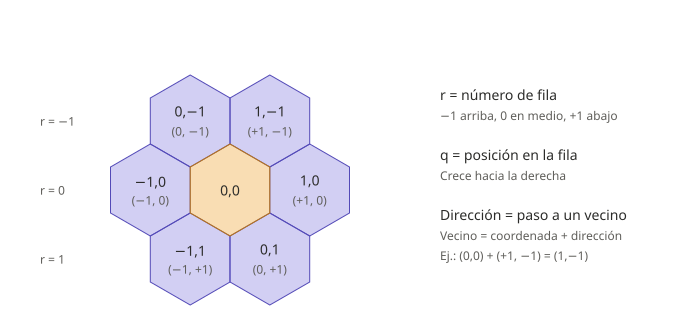
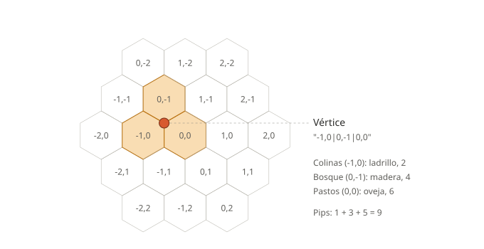
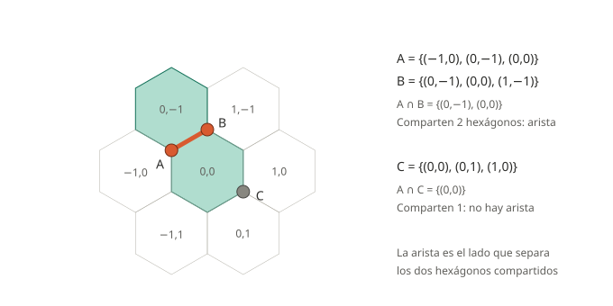
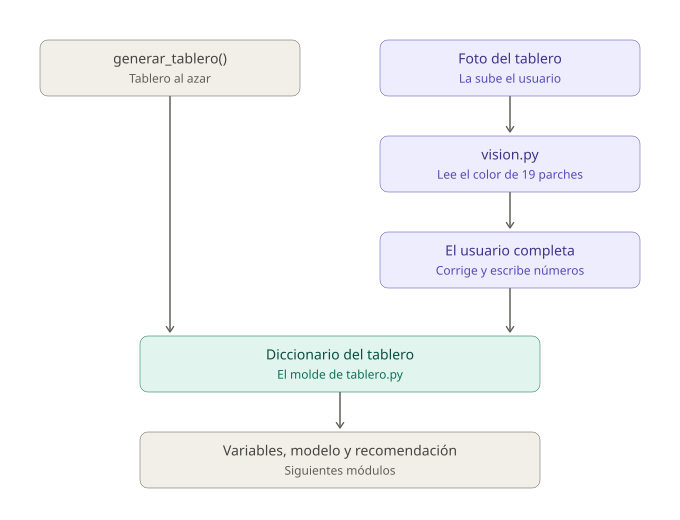

# El módulo `tablero.py`

> Guía de estudio del primer archivo del dominio. Explica qué hace el módulo, cómo representa el tablero y por qué se tomaron esas decisiones. Complementa a `conceptos-catan.md`, que explica el juego; este documento explica el código.

**Ubicación:** `backend/app/domain/tablero.py`

---

## 1. Qué hace el módulo

`tablero.py` convierte el tablero físico de Catan en datos de Python. Responde tres preguntas:

1. **¿Qué existe en un tablero?** 19 hexágonos, 54 vértices (esquinas, donde van los poblados) y 72 aristas (lados, donde van los caminos).
2. **¿Cómo se arma un tablero al azar?** Revolviendo terrenos, fichas numéricas y puertos, respetando las reglas del juego base.
3. **¿Qué produce cada esquina?** Cuántos pips suma, de qué recursos y si da acceso a un puerto.

Es **Python puro**: no sabe que existe la web, la foto ni el modelo. Por eso lo pueden usar los notebooks, el simulador, las variables del modelo, los serializadores de la API y la visión sin que ninguno dependa de los demás.

Lo que **no** hace: no simula partidas (eso es `simulador.py`) ni calcula las variables del modelo (eso es `variables.py`). Solo representa el tablero y las reglas de armado.

**La decisión de diseño central:** el código nunca usa geometría (ángulos, distancias, pixeles). Un vértice se guarda como el **conjunto de los tres hexágonos que toca**, y toda la adyacencia sale de preguntar cuántos hexágonos comparten dos elementos.

---

## 2. Constantes: las reglas escritas como datos

El inicio del archivo es la caja del juego convertida en diccionarios y listas. Nada se calcula, solo se declara.

| Constante | Qué guarda |
|---|---|
| `DIRECCIONES` | Los 6 pasos para ir de un hexágono a sus vecinos |
| `TERRENOS` | Cuántos hexágonos hay de cada terreno (suman 19) |
| `RECURSO_DE_TERRENO` | Qué recurso produce cada terreno (el desierto, ninguno) |
| `FICHAS` | Las 18 fichas numéricas del juego base |
| `PIPS` | En cuántas de las 36 combinaciones de dos dados sale cada número |
| `PUERTOS` | Los 9 puertos: 4 genéricos 3:1 y 5 específicos 2:1 |
| `COSTOS` | Qué recursos cuesta cada construcción |

Los nombres en MAYÚSCULAS son una convención de Python para indicar "esto es una constante, no lo modifiques".

---

## 3. Coordenadas axiales y direcciones

Cada hexágono tiene una coordenada `(q, r)`:

- **`r` es el número de fila**: −1 arriba del centro, 0 en medio, +1 abajo.
- **`q` es la posición dentro de la fila**: crece hacia la derecha.

Una **dirección** es cuánto hay que sumarle a una coordenada para llegar a un vecino. Hay seis, una por lado del hexágono.



En un tablero de hexágonos las filas están desfasadas medio hexágono, así que no existe un vecino "justo abajo": hay uno abajo a la izquierda `(−1, +1)` y otro abajo a la derecha `(0, +1)`. El sistema axial absorbe ese desfase inclinando las columnas. Se llama *axial* porque usa solo dos ejes, aunque en una rejilla hexagonal las líneas corren en tres direcciones.

### `coordenadas_hexagonos()`

```python
for r in range(-2, 3):
    for q in range(-2, 3):
        if abs(q + r) <= 2:
            coords.append((q, r))
```

Recorre una cuadrícula de 5×5 y descarta las casillas con `|q + r| > 2`. Esa condición recorta las esquinas y deja la forma de la isla, con filas de 3, 4, 5, 4 y 3 hexágonos: **19 en total**.

### `vecinos(hexagono)`

```python
DIRECCIONES = [(1, 0), (1, -1), (0, -1), (-1, 0), (-1, 1), (0, 1)]

def vecinos(hexagono):
    q, r = hexagono
    return [(q + dq, r + dr) for dq, dr in DIRECCIONES]
```

Le suma cada dirección al hexágono. Las direcciones están en **orden circular** (este, noreste, noroeste, oeste, suroeste, sureste), y ese orden importa para construir los vértices. Algunos vecinos caen fuera de la isla: eso es el mar.

---

## 4. Vértices

Un vértice es la esquina donde se tocan tres hexágonos. Es donde se colocan poblados y ciudades.

### `vertices_de_hexagono(hexagono)`

```python
vs = vecinos(hexagono)
return [frozenset({hexagono, vs[i], vs[(i + 1) % 6]}) for i in range(6)]
```

Cada esquina de un hexágono es **el hexágono más dos vecinos consecutivos**. El `% 6` hace que después del vecino 5 se regrese al 0, para cerrar el círculo.



*Ejemplo con un tablero generado en `/docs`: el vértice toca colinas con un 2, bosque con un 4 y pastos con un 6, así que suma 1 + 3 + 5 = 9 pips.*

**Por qué `frozenset` y no una lista.** En un conjunto el orden no importa: `{A, B, C}` es igual a `{C, A, B}`. Así, la misma esquina calculada desde cualquiera de sus tres hexágonos da el mismo objeto, y Python la cuenta una sola vez. El `frozen` significa que no se puede modificar, que es requisito para meterlo dentro de otro conjunto o usarlo como llave de un diccionario.

### `todos_los_vertices()`

Junta las 6 esquinas de cada uno de los 19 hexágonos en un conjunto. Como las esquinas compartidas son el mismo `frozenset`, se eliminan los repetidos solos y quedan **54 vértices**.

### Cómo viaja un vértice por la API

Un `frozenset` no se puede mandar en JSON. `services/serializers.py` lo convierte a texto ordenando sus tres hexágonos y uniéndolos con `|`:

```
frozenset({(0, 0), (-1, 0), (0, -1)})   →   "-1,0|0,-1|0,0"
```

El orden fijo garantiza un solo nombre por esquina, y `vertice_desde_id()` hace la conversión de regreso.

### Vértices de costa

Algunos de los tres hexágonos de un vértice caen fuera de la isla, por ejemplo `"-3,0|-3,1|-2,0"`, donde `-3,0` y `-3,1` son mar. Eso distingue un vértice de costa de uno interior sin marcarlo aparte:

| Hexágonos de la isla que toca | Vértices |
|---|---|
| 3 (interior) | 24 |
| 2 (costa) | 12 |
| 1 (costa) | 18 |

---

## 5. Aristas

Una arista es un lado de hexágono, el segmento entre dos esquinas. Es donde se colocan los caminos.

### `todas_las_aristas()`

```python
for i, a in enumerate(vertices):
    for b in vertices[i + 1:]:          # cada pareja una sola vez
        if len(a & b) == 2:             # ¿comparten exactamente 2 hexágonos?
            aristas.add(frozenset({a, b}))
```

`&` es la **intersección** de conjuntos (`∩` en matemáticas): lo que tienen en común. Dos vértices están unidos por una arista si comparten **exactamente dos hexágonos**.



Las dos esquinas en los extremos de un lado tocan los dos hexágonos que ese lado separa, y además cada una toca un tercero distinto. El número de hexágonos compartidos dice qué relación tienen:

| Hexágonos compartidos | Significado |
|---|---|
| 3 | Es el mismo vértice |
| 2 | Son vecinos, unidos por una arista |
| 1 o 0 | Están separados |

El ciclo compara las 1,431 parejas posibles de los 54 vértices y se queda con **72 aristas**. `vertices[i + 1:]` evita comparar A con B y después B con A.

### La misma prueba, reutilizada

- **`vertices_adyacentes()`** aplica `len(v & vertice) == 2` para encontrar las esquinas vecinas de un poblado. Es la base de la **regla de distancia**: en Catan no se puede construir un poblado junto a otro.
- **Aristas de costa.** En `_colocar_puertos`, una arista es de costa si, de los dos hexágonos que comparten sus vértices, exactamente uno está en la isla y el otro es mar (`len(compartidos & en_tablero) == 1`). Ahí es donde pueden ir los puertos.

---

## 6. Generar un tablero aleatorio

### `generar_tablero(semilla=None, evitar_rojos_juntos=True)`

Hace lo mismo que se haría en la mesa: revuelve los terrenos y los reparte, revuelve las fichas y las reparte a todos menos al desierto, y coloca los puertos.

```python
rng = random.Random(semilla)
for _ in range(1000):
    rng.shuffle(bolsa_terrenos)
    ...
    if not _seis_y_ocho_adyacentes(terrenos, numeros, hexes):
        break
else:
    raise RuntimeError("No se encontró una colocación válida en 1000 intentos")
```

Tres conceptos:

- **`random.Random(semilla)`** crea un generador de azar propio. La misma semilla produce siempre el mismo tablero, lo que hace reproducibles los experimentos. Es el equivalente de `set.seed()` en R.
- **Muestreo por rechazo.** Si un 6 o un 8 queda junto a otro 6 u 8, el tablero se descarta y se vuelve a revolver. El reglamento desaconseja esa colocación porque concentra demasiada producción en una zona.
- **`for ... else`.** El `else` se ejecuta solo si el ciclo terminó **sin** `break`, es decir, si en 1000 intentos nunca salió un tablero válido. Es un seguro contra un ciclo infinito.

Devuelve un diccionario con `hexagonos`, `terrenos`, `recursos`, `numeros`, `pips`, `puertos` y `semilla`. **Este diccionario es el formato común** que usa todo el resto del sistema.

### `_colocar_puertos(rng, hexes)`

Busca las aristas de costa, las revuelve y elige 9 sin que dos compartan vértice. Luego les asigna los 9 tipos de puerto al azar.

El guion bajo inicial (`_colocar_puertos`, `_seis_y_ocho_adyacentes`) es una convención de Python: significa "función interna, no la uses desde fuera de este archivo".

---

## 7. Consultas sobre un vértice

Estas funciones son la materia prima de las variables del modelo.

| Función | Qué devuelve |
|---|---|
| `hexagonos_del_vertice(v, tablero)` | Los hexágonos del vértice que sí están en la isla (entre 1 y 3) |
| `pips_del_vertice(v, tablero)` | La suma de pips de esos hexágonos |
| `pips_por_recurso(v, tablero)` | Los mismos pips, separados por recurso |
| `puerto_del_vertice(v, tablero)` | El tipo de puerto al que da acceso, o `None` |

```python
def pips_del_vertice(vertice, tablero):
    return sum(tablero["pips"][h] for h in hexagonos_del_vertice(vertice, tablero))
```

**Interpretación:** los pips de un número son cuántas de las 36 combinaciones de dos dados lo producen. Sumar los pips de un vértice da cuántas veces se espera que produzca por cada 36 tiradas: es una **esperanza matemática**.

---

## 8. Verificación

### `verificar_tablero(tablero)`

Revisa con `assert` que el tablero cumpla las reglas del juego base y, si algo falla, detiene el programa con un mensaje claro. Estos números deben cuadrar siempre (sección 5.9 de `AGENTS.md`):

| Elemento | Cantidad |
|---|---|
| Hexágonos | 19 |
| Vértices | 54 |
| Aristas | 72 |
| Fichas numéricas | 18 |
| Puertos | 9 |
| Total de pips | 58 |

### Ejecutar el módulo

Desde `backend/`:

```
uv run python -m app.domain.tablero
```

El bloque `if __name__ == "__main__":` al final del archivo solo corre cuando se ejecuta el archivo directamente, no cuando otro archivo lo importa. Imprime 19, 54 y 72, verifica el tablero con semilla 42 y muestra sus 5 mejores vértices. El primero debe ser uno de 12 pips: campos con 6, pastos con 5 y montañas con 4.

---

## 9. Cómo se conecta con la foto

`tablero.py` no lee fotos; eso lo hace `services/vision.py`. Pero define el **molde** que la foto tiene que llenar.



Hay dos formas de obtener un tablero y las dos terminan en el mismo diccionario: `generar_tablero()` lo inventa al azar (para entrenar el modelo y para el endpoint de tablero aleatorio), y la foto lo obtiene del usuario real. A partir de ahí, el resto del sistema no distingue de dónde vino.

Como la forma de la isla es fija, la visión no busca hexágonos: endereza la foto a una vista cenital (homografía) y calcula dónde cae cada uno con las mismas coordenadas axiales:

```python
def _centro_en_lienzo(q, r):
    x = LADO / 2 + paso_x * (q + r / 2)   # el desfase de medio hexágono por fila
    y = LADO / 2 + paso_y * r             # r = número de fila
```

Luego clasifica el color de un anillo alrededor de cada centro, evitando el círculo central donde está la ficha numérica. Un problema difícil ("encontrar hexágonos en una foto") se convierte en uno fácil ("clasificar el color de 19 recortes").

---

## 10. Preguntas probables en el Q&A

- **¿Por qué hay 54 vértices?** Son todas las esquinas distintas de los 19 hexágonos; las compartidas se cuentan una vez gracias a los conjuntos.
- **¿Cómo sabes si dos vértices son vecinos?** Comparten exactamente dos hexágonos.
- **¿Cómo sabes si un vértice está en la costa?** Alguno de sus tres hexágonos está fuera de la isla.
- **¿Por qué evitas 6 y 8 juntos?** Es la recomendación del reglamento para no concentrar la producción.
- **¿Por qué conjuntos y no coordenadas x/y?** Porque la adyacencia, los pips y la regla de distancia salen de intersecciones, sin cálculos geométricos ni errores de redondeo.
- **¿Para qué la semilla?** Para que cualquier tablero y cualquier experimento sean reproducibles.

---

## 11. Pendientes detectados al revisar el módulo

Para revisar con el chat principal antes de la demo:

- **Posición de los puertos.** `_colocar_puertos` los pone en cualquier arista de costa. En el juego base los puertos van en posiciones fijas del marco, así que el simulador entrena con configuraciones que no aparecen en una mesa real. Decidir si se corrige o se documenta como limitación.
- **La foto no captura puertos.** `vision.py` arma el tablero con `"puertos": []` y no hay todavía un paso para que el usuario los marque. Como `puerto_alineado` es una variable del modelo, con una foto real la recomendación ignoraría los puertos.
- **Comentario de `RANGOS` en `vision.py`.** Dice que los rangos se midieron sobre fotos reales, pero se eligieron para un render sintético. Corregirlo hasta calibrar con fotos reales.
- **Ruta desactualizada en `conceptos-catan.md`.** Menciona `src/tablero.py`; la ruta actual es `backend/app/domain/tablero.py`.
